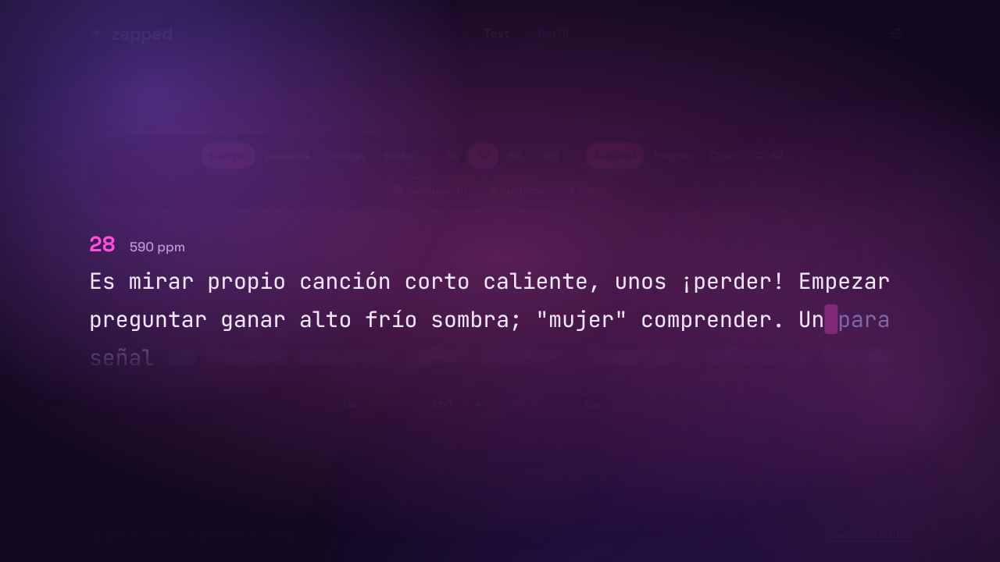
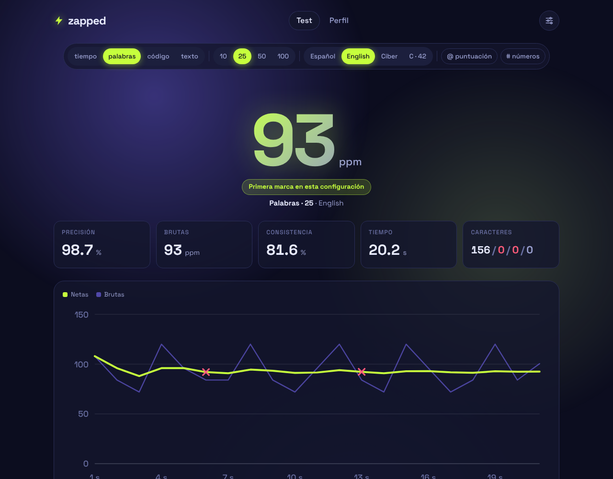
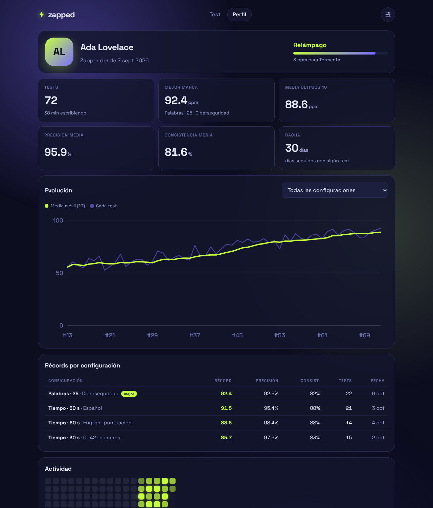
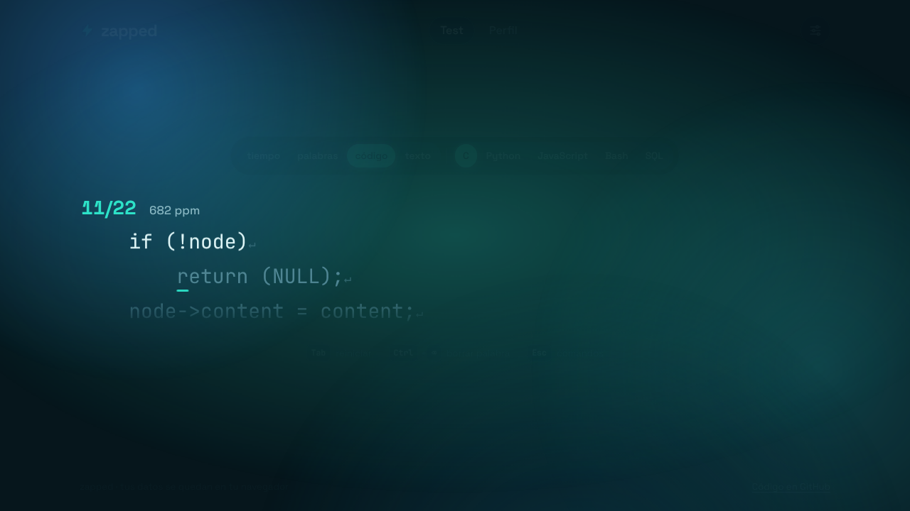
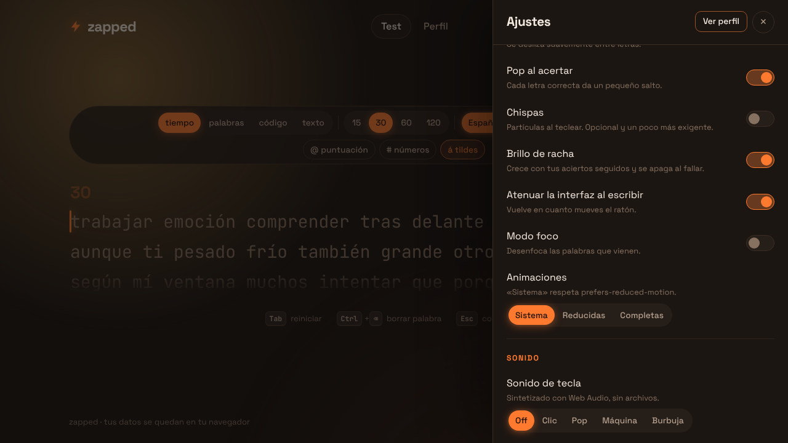
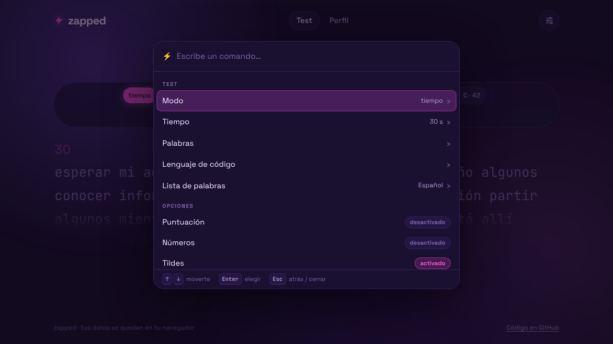
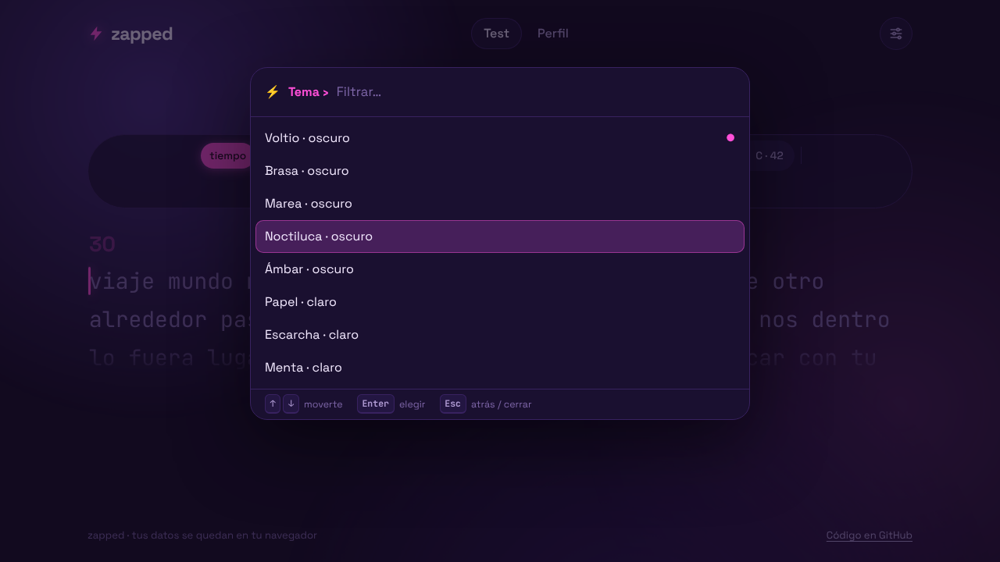
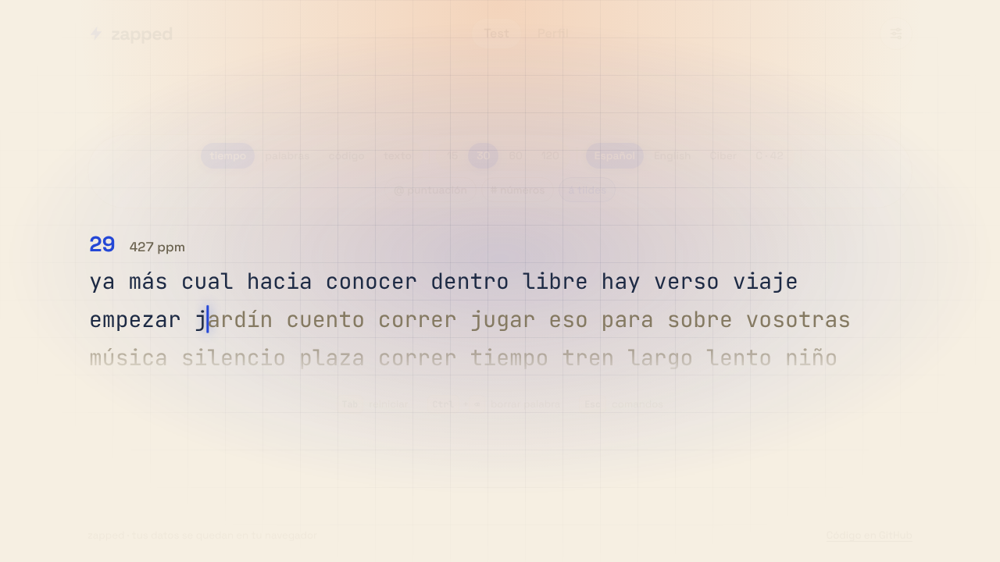
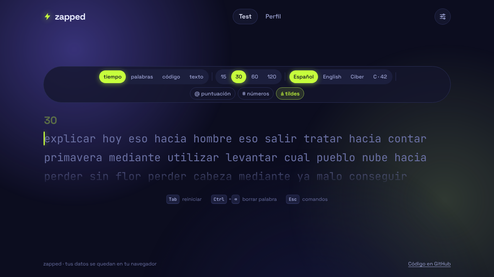
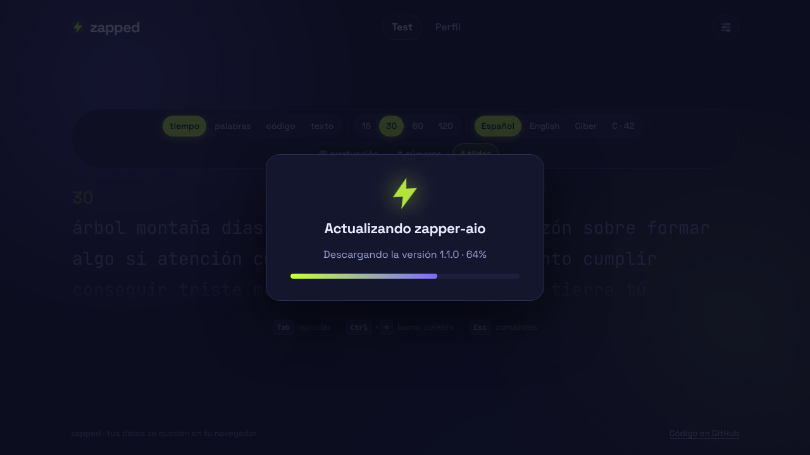

<div align="center">

# ⚡ zapped

**Un test de mecanografía con chispa.** Animado, muy personalizable y sin backend.

Español, inglés, ciberseguridad, C (al estilo 42) y modo código · barra de comandos con `Esc` · cursor que se desliza · brillo de racha · sonidos sintetizados · perfil con estadísticas · sincronización opcional con un gist secreto · **app de escritorio con instalador y auto‑actualización (zapper‑aio)**.



</div>

---

## Características

**Test**

- Modos **tiempo** (15 / 30 / 60 / 120 s), **palabras** (10 / 25 / 50 / 100), **código** (fragmentos de C, Python, JavaScript, Bash y SQL) y **texto propio** (pega prosa o código). Todo se cambia desde la barra de arriba, sin entrar en ajustes.
- Listas de palabras: **español** (con o sin tildes, con o sin ñ y con o sin los signos ¿ ¡), **inglés**, **ciberseguridad** (`nmap`, `payload`, `kerberos`, `iptables`…) y **C** (`ft_strlen`, `malloc`, `-Wall -Wextra -Werror`, `valgrind --leak-check=full`…).
- Opciones de **puntuación** (con `¿?` y `¡!` en español, símbolos de C en la lista de C) y de **números**.
- **Barra de comandos** (`Esc`): busca cualquier opción, activa o desactiva ajustes sin cerrarla y cambia tema, fuente, tiempo, modo, lenguaje de código, cursor, sonido o fondo al instante, con **vista previa en vivo**.
- **No avanzar hasta acertar**: una letra incorrecta no se escribe y el cursor espera la correcta.
- Métricas completas: ppm netas, ppm en bruto, precisión, consistencia y caracteres correctos / fallos / extra / omitidos.

**Animado y agradable**

- Cursor que **se desliza** entre letras: línea, bloque o subrayado.
- **Pop** en cada letra acertada y **chispas** opcionales.
- **Brillo de racha**: un aura de fondo que crece con tus aciertos seguidos y se apaga al fallar.
- La interfaz **se atenúa mientras escribes** y vuelve al mover el ratón.
- **Modo foco**: desenfoca las palabras que vienen.
- **Sonidos** sintetizados con Web Audio (clic, pop, máquina de escribir, burbuja), con volumen y sonido de error opcional. Sin archivos de audio.
- Resultado con el número grande animado y una gráfica de ppm por segundo que se dibuja sola, con los segundos con fallos marcados.
- Respeta `prefers-reduced-motion` (y se puede forzar desde los ajustes).

**Personalización**

- 8 temas con nombre propio: **Voltio**, **Brasa**, **Marea**, **Noctiluca**, **Ámbar** (oscuros), **Papel**, **Escarcha** y **Menta** (claros), más un **color de acento** libre y colores propios para el texto acertado, el texto por escribir y los errores.
- 8 tipografías monoespaciadas (JetBrains Mono, Fira Code, IBM Plex Mono, Space Mono, Source Code Pro, Roboto Mono, Inconsolata y la del sistema) y tamaño de texto ajustable.
- **Fondo** a elegir: aurora animada, cuadrícula, puntos, degradado con tus colores, liso o **tu propia imagen** (con oscurecido y desenfoque para que se lea bien).
- Todo se guarda automáticamente.

**Datos**

- Por defecto, ajustes e historial viven en `localStorage`: nada sale de tu navegador.
- **Perfil**: rango por velocidad, total de tests, mejor marca, media de los últimos 10, precisión y consistencia medias, racha de días, **récords por configuración**, gráfica de evolución, mapa de actividad e historial.
- **Sincronización opcional** con un gist secreto de tu cuenta de GitHub.
- **Exportar e importar** todo en JSON.

| | |
|---|---|
|  |  |
|  |  |
|  |  |
|  |  |

## Stack

**Vite + TypeScript, sin framework.** La app es un bucle de teclado, DOM y SVG, así que un framework no aporta nada y solo añadiría peso: el build entero son ~110 kB de JS (~37 kB gzip) y cero dependencias en ejecución. TypeScript estricto da contratos claros entre módulos y Vite da `npm run dev` y un build estático listo para GitHub Pages. Los tests (Vitest) cubren el motor, las métricas, el generador de palabras y la fusión de datos.

## App de escritorio: zapper-aio

La misma app, empaquetada con Electron como programa de escritorio: **instalador**, datos guardados en tu usuario, **sincronización con tu otro ordenador** y **actualización automática**.



### Instalarla

1. Ve a la pestaña **Releases** del repositorio y descarga el instalador de tu sistema:
   - **Windows**: `zapper-aio-Setup-<versión>.exe` (instalador con asistente; elige carpeta, crea acceso directo).
   - **Linux**: `zapper-aio-<versión>.AppImage` (`chmod +x` y ejecútalo).
   - **macOS**: `zapper-aio-<versión>-<arq>.dmg`. Como no está firmada con un certificado de Apple, macOS **no puede actualizarla sola**: hay que descargar la nueva versión a mano.
2. Windows mostrará el aviso de *SmartScreen* («Windows protegió su PC») porque el instalador no está firmado: **Más información → Ejecutar de todas formas**.

### Dónde se guardan tus datos

En la carpeta de tu usuario, **fuera** de la carpeta del programa, así que actualizar o desinstalar **no los borra**:

| Sistema | Ruta |
|---|---|
| Windows | `%APPDATA%\zapper-aio` |
| macOS | `~/Library/Application Support/zapper-aio` |
| Linux | `~/.config/zapper-aio` |

Además de la copia normal, la app guarda un archivo `backup/zapped-data.json` en esa misma carpeta (con el último estado, y `.prev` con el anterior). Si por lo que sea se vaciara el almacenamiento del navegador interno, **al abrir se restaura sola desde esa copia**.

### Sincronizar con el ordenador de casa

Funciona igual que en la web, con el mismo token de GitHub (permiso `gist`): en **cada** ordenador abre **Ajustes → Datos y nube**, pega **el mismo token** y pulsa *Conectar*. Ajustes e historial se fusionan sin duplicados y se mantienen al día solos. Pasos para crear el token, más abajo en [Sincronizar con un gist de GitHub](#sincronizar-con-un-gist-de-github). **El token no lo pegues en ningún chat ni lo subas al repo**: solo se escribe dentro de la app.

### Actualización automática

Al abrir la app busca una versión nueva en los Releases del repositorio. Si la hay, muestra la pantalla de actualización con el progreso, la **instala y se reinicia sola**. Si encuentra una mientras la estás usando (comprueba cada 4 horas) no te interrumpe: aparece un aviso con *Reiniciar ahora* y, si lo ignoras, se instala al cerrar la app. En **Ajustes → Acerca de** puedes ver la versión y buscar actualizaciones a mano (también desde la barra de comandos).

> La auto‑actualización necesita que el repositorio sea **público** (la app consulta los Releases sin credenciales) y funciona en Windows (instalador NSIS) y Linux (AppImage).

### Publicar una versión nueva

```bash
npm version patch            # 1.0.0 -> 1.0.1 (usa minor o major si procede)
git push origin main --follow-tags
```

Al subir la etiqueta `v1.0.1`, el workflow [`release.yml`](.github/workflows/release.yml) comprueba que coincide con `package.json`, crea el Release y construye y sube los instaladores de Windows, Linux y macOS junto con los ficheros `latest*.yml` que usan las apps instaladas para detectar la versión. **La primera vez** instala a mano la versión 1.0.0; a partir de ahí, cada versión que publiques llegará sola a los ordenadores donde esté instalada.

### Desarrollo de la app de escritorio

```bash
npm run desktop        # compila web + escritorio y abre la ventana
npm run desktop:pack   # carpeta empaquetada en release/ (sin instalador)
npm run desktop:dist   # instalador de tu sistema en release/ (sin publicar)
```

Para ver la pantalla de actualización sin publicar nada: `ZAPPER_FAKE_UPDATE=9.9.9 npm run desktop` (en Windows PowerShell: `$env:ZAPPER_FAKE_UPDATE="9.9.9"; npm run desktop`). Si prefieres otro nombre para la app, se cambia en `package.json` (`productName`) y en `electron-builder.yml`.

La ventana usa `contextIsolation` y `sandbox`, no tiene acceso a Node, solo abre enlaces `https` en el navegador, deniega permisos y lleva una política CSP que limita las conexiones a `api.github.com`. El puente con la web (`desktop/preload.cts`) expone únicamente: versión, buscar/instalar actualización y leer/escribir la copia de seguridad.

## Ejecutarlo en local

Necesitas Node 20 o superior.

```bash
git clone https://github.com/euZAPUS/zapped.git
cd zapped
npm install

npm run dev        # servidor de desarrollo en http://localhost:5173
npm run build      # genera dist/
npm run preview    # sirve dist/ en http://localhost:4173
npm test           # tests unitarios
```

El build está pensado para funcionar **también abriendo `dist/index.html` directamente** con doble clic (se emite como un único script clásico, sin módulos ES, que los navegadores bloquean en `file://`), y se puede servir desde cualquier subcarpeta porque todas las rutas son relativas.

## Publicar en GitHub Pages

El workflow [`.github/workflows/deploy.yml`](.github/workflows/deploy.yml) ejecuta los tests, compila y despliega en cada push a `main`. Solo hay que activarlo una vez:

1. Sube el repositorio a GitHub.
2. Ve a **Settings → Pages**.
3. En **Build and deployment → Source** elige **GitHub Actions**.
4. Haz push a `main` (o lanza el workflow a mano desde la pestaña **Actions**).

La web quedará en `https://<tu-usuario>.github.io/zapped/`. No hace falta tocar ninguna configuración si cambias el nombre del repositorio.

## Sincronizar con un gist de GitHub

La sincronización es opcional y no tiene servidor: la propia web habla con la API de GitHub desde tu navegador y guarda tus datos en un **gist secreto** de tu cuenta (`zapped-data.json`).

### 1. Crear el token

La forma más rápida es [abrir esta página](https://github.com/settings/tokens/new?scopes=gist&description=zapped), que ya trae marcado el permiso `gist`. A mano:

- **Token clásico**: GitHub → *Settings* → *Developer settings* → *Personal access tokens* → *Tokens (classic)* → *Generate new token (classic)*. Marca **solo** el permiso `gist`.
- **Token de grano fino**: *Fine-grained tokens* → permisos de cuenta → **Gists: Read and write**. No necesita acceso a ningún repositorio.

Pon la caducidad que prefieras y copia el token (empieza por `ghp_` o `github_pat_`).

### 2. Conectarlo

Abre los **Ajustes** (botón del engranaje, o `Esc` → «Abrir todos los ajustes»), baja hasta **Datos y nube**, pega el token y pulsa **Conectar**. Si ya tenías un gist de zapped en tu cuenta (por ejemplo, creado desde otro dispositivo), lo reutiliza; si no, crea uno secreto.

### Cómo se fusionan los datos

- **Historial**: se unen los tests de ambos lados por identificador, sin duplicados, aunque sincronices cien veces o importes el mismo archivo dos veces.
- **Ajustes**: gana la copia modificada más recientemente.
- **Borrar historial** se propaga: los tests borrados no vuelven desde otro dispositivo.
- Se sincroniza tras cada test y al abrir la app (se puede desactivar), y a mano con **Sincronizar ahora**.

### Seguridad

- El token **solo se guarda en `localStorage` de tu navegador** y solo se envía a `api.github.com`. No está en el repositorio, ni en el gist, ni en las exportaciones JSON.
- Conviene un token con **solo** el permiso `gist`: así, aunque se filtrara, no daría acceso a tu código.
- Quien tenga la URL de un gist secreto puede leerlo (es lo que significa «secreto», no «privado»). Tus datos son solo ajustes y resultados de tests.
- **Desconectar** borra el token de ese navegador. Puedes revocarlo cuando quieras en GitHub.

## Cómo se calculan las métricas

| Métrica | Definición |
|---|---|
| **ppm netas** | (caracteres de palabras escritas sin ningún fallo + sus espacios) ÷ 5 ÷ minutos. Una palabra con un fallo no suma, igual que en Monkeytype, para que los números sean comparables. |
| **ppm en bruto** | Todo lo escrito (acertado o no, con espacios) ÷ 5 ÷ minutos. |
| **Precisión** | Pulsaciones correctas ÷ pulsaciones totales. Corregir un fallo con retroceso **sigue contando** como fallo: mide cómo escribes, no cómo queda el texto. |
| **Consistencia** | 100 es una velocidad perfectamente estable. Se calcula con el coeficiente de variación de las ppm brutas de cada segundo, pasado por una curva saturante (como Monkeytype). |
| **Caracteres** | Correctos / fallos / extra (letras de más) / omitidos (letras que saltaste al pulsar espacio). La palabra que quedó a medias al acabar el tiempo no cuenta como omitida. |

La gráfica del resultado muestra las ppm netas acumuladas y las brutas de cada segundo; una `×` marca los segundos con fallos.

## Atajos de teclado

| Tecla | Acción |
|---|---|
| `Tab` | Reinicia con palabras nuevas |
| `Ctrl` + `⌫` (o `Alt` + `⌫`) | Borra la palabra actual |
| `Esc` | Abre la **barra de comandos**: escribe para buscar, `↑` `↓` para moverte, `Enter` para elegir, `Esc` para volver o cerrar |
| `Enter` | Tras el resultado, lanza otro test. En modo texto, escribe el salto de línea |

### La barra de comandos

`Esc` abre una barra al estilo Monkeytype. Sin escribir nada ves las secciones **Test** (modo, tiempo, palabras, lenguaje de código, lista de palabras), **Opciones** (puntuación, números, tildes, ñ, signos ¿¡, no avanzar hasta acertar, ppm en vivo, cursor deslizante, pop, chispas, brillo, atenuar interfaz, modo foco, sonido de error), **Apariencia** (tema, fuente, tamaño, acento, cursor, fondo, sonido, animaciones) e **Ir a** (nuevo test, perfil, ajustes completos, editar texto…). Escribiendo filtras: `tema marea`, `60`, `codigo python`, `fuente fira`…

- Los **interruptores** se activan y desactivan sin cerrar la barra, así que puedes cambiar varios seguidos.
- En los submenús (tema, fuente, cursor, sonido, acento…) **moverte por la lista previsualiza el cambio en vivo**; `Esc` lo deshace y `Enter` lo guarda.
- El panel de **Ajustes** completo sigue disponible con el botón del engranaje o desde la barra («Abrir todos los ajustes»).

### ¿Y `Tab` con código?

En el modo **texto propio** las líneas se escriben con `Enter`, y **la sangría del principio de cada línea se salta sola** (se ve en la pantalla, pero no hay que escribirla). Así nunca necesitas teclear un tabulador y `Tab` puede seguir reiniciando el test, también con código. Los espacios o tabuladores repetidos *dentro* de una línea se colapsan en un solo espacio.

## Estructura del proyecto

```
src/
├─ main.ts                 arranque y cableado de los módulos
├─ engine/                 motor del test, sin DOM (y por tanto testeable)
│  ├─ test-engine.ts       máquina de estados: teclas, palabras, modos, muestras por segundo
│  ├─ metrics.ts           ppm, precisión, consistencia, desglose de caracteres
│  └─ words.ts             generador (puntuación, números, tildes) y parser de texto propio
├─ data/words/             listas: es, en, cyber, c42
├─ data/snippets.ts        fragmentos del modo código (C, Python, JS, Bash, SQL)
├─ render/                 todo lo que se dibuja
│  ├─ text-view.ts         texto, líneas, cursor y modo foco
│  ├─ effects.ts           pop, chispas y brillo de racha
│  ├─ result-view.ts       pantalla de resultado
│  ├─ charts.ts            gráficas SVG propias (tooltip, tabla accesible)
│  ├─ dock.ts              barra de configuración del test
│  └─ background.ts        fondos personalizables
├─ settings/               esquema y validación, almacén observable y panel de ajustes
├─ stats/                  historial y agregados (récords, rachas, rangos)
├─ audio/sound.ts          sonidos sintetizados con Web Audio
├─ sync/                   cliente de gists, fusión, exportar/importar y gestor de sync
├─ storage/local.ts        localStorage tolerante a fallos
├─ app/                    controlador del test, teclado, router, perfil, diálogos,
│                          barra de comandos (palette.ts / commands.ts) y piezas de la app de escritorio
├─ ui/                     utilidades de DOM, controles, modales, motion
└─ styles/                 tokens de tema y hojas de estilo
desktop/                   app de escritorio (Electron): main, preload y actualizador (.cts)
build/                     icono de la app
electron-builder.yml       configuración de los instaladores
tests/                     Vitest: motor, métricas, palabras, fragmentos, fusión de datos
scripts/screenshots.mjs    regenera las capturas del README
```

Para regenerar las capturas: `npm run build && npm run screenshots` (usa Chromium vía `playwright-core`; si no lo encuentra, indica su ruta con `CHROMIUM_PATH`).

## Accesibilidad

Foco de teclado siempre visible, ajustes y diálogos con `<dialog>` nativo (foco atrapado y `Esc` para cerrar), gráficas con tabla de datos para lectores de pantalla, `prefers-reduced-motion` respetado y contraste revisado en los ocho temas (texto principal por encima de 11:1 y acentos por encima de 4,5:1 sobre el fondo en los temas claros). Diseño responsive; en móvil el teclado se abre al tocar el texto.

## Licencia

[MIT](LICENSE)
